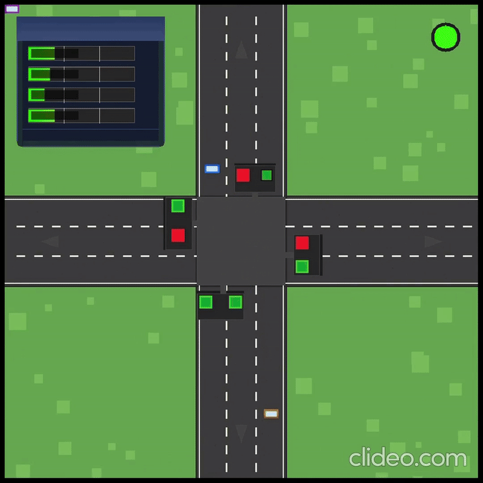

# Traffic Junction Simulator 🚦

Welcome to the Traffic Junction Simulator, a project designed to simulate and visualize traffic flow at a four-way intersection using SDL2. The simulator demonstrates the integration of queue data structures, priority-based traffic management, and dynamic traffic light control to manage vehicle movement and congestion.

## Table of Contents
- [Overview](#overview)
- [Key Features](#key-features)
  - [Vehicle Management](#vehicle-management)
  - [Traffic Light Control](#traffic-light-control)
  - [Advanced Simulation](#advanced-simulation)
- [Technical Details](#technical-details)
  - [Core Components](#core-components)
  - [Algorithms](#algorithms)
- [System Requirements](#system-requirements)
- [Installation](#installation)
  - [Dependencies](#dependencies)
  - [Build and Run](#build-and-run)
- [Project Structure](#project-structure)
- [Academic Relevance](#academic-relevance)
- [Contributing](#contributing)
- [References](#references)

## Overview
The Traffic Junction Simulator provides a real-time simulation of a four-way traffic junction. It utilizes SDL2 for graphics rendering and SDL2_ttf for text output. The simulator models realistic traffic behavior, including smooth vehicle animations, adaptive signal control, and emergency vehicle prioritization.




## Key Features

### Vehicle Management
- **FIFO Queues**:
  - Each lane (A, B, C, D) employs a First-In-First-Out (FIFO) queue to manage the sequencing of vehicles.

- **Emergency Vehicles**:
  - Vehicles marked as emergency are prioritized to reduce response times.

- **Turning Logic**:
  - Vehicles execute smooth left and right turns using Bézier curves combined with rotation animations.

### Traffic Light Control
- **Dynamic Timing**:
  - The duration of each traffic signal is dynamically adjusted based on the number of vehicles waiting in each lane.

- **Priority Lanes**:
  - Lanes experiencing high congestion are given priority to decrease wait times.

- **Express Lanes**:
  - Left-turning vehicles can bypass standard traffic signals, ensuring a continuous flow.

### Advanced Simulation
- **Realistic Movement**:
  - Vehicles mimic natural acceleration and deceleration patterns, enhancing the realism of the simulation.

- **Intelligent Routing**:
  - The simulation logic ensures vehicles navigate the intersection efficiently while avoiding collisions.

## Technical Details

### Core Components
- **Queue System**:
  - Implements standard FIFO queues for orderly vehicle management in each lane.

- **Priority Queue**:
  - Specifically designed to handle emergency vehicles and lanes with heavy congestion.

- **Animation Engine**:
  - Uses Bézier curves for smooth transitions and rotations to simulate turning motions.

### Algorithms
- **Signal Timing Formula**:
  ```
  Total Signal Time = |V| * t  
  ```
  - `|V|`: Weighted average of waiting vehicles computed as:
    ```
    |V| = (1/n) ∑|Li|
    ```
    where `n` is the total number of standard lanes and `|Li|` is the number of vehicles in lane `i`.
  
  - `t`: Processing interval per vehicle (2 seconds).

- **Adaptive Lane Prioritization**:
  - **Activation**:
    - A lane gains priority when the number of vehicles exceeds 10.
  
  - **Revocation**:
    - Priority is revoked when the count drops below 5.

## System Requirements
- **C Compiler**:
  - GCC or Clang is recommended.

- **Libraries**:
  - SDL2 for graphics rendering.
  - SDL2_ttf for text rendering.
  - pthread for multi-threading support.

## Installation

### Dependencies

#### Linux
```bash
sudo apt-get update  
sudo apt-get install libsdl2-dev libsdl2-ttf-dev
```

#### macOS (using Homebrew)
```bash
brew install sdl2 sdl2_ttf
```

#### Windows
Download and install SDL2 and SDL2_ttf from the official SDL website. Ensure the libraries are added to your system's PATH.

### Build and Run

1. **Clone the Repository**:
   ```bash
   git clone https://github.com/aryankoju17/DSA-Traffic-Simulator  
   cd DSA-Traffic-Simulator
   ```

2. **Compile the Program**:
   ```bash
   gcc .\src\simulator.c -o sim -Dmain=SDL_main -lmingw32 -lSDL2main -lSDL2 -lSDL2_ttf
	gcc .\src\traffic_generator.c -o tra_gen -Dmain=SDL_main -lmingw32 -lSDL2main -lSDL2 -lSDL2_ttf

   ```

3. **Run the Simulator**:
   
   Make sure the vehicles.data file is in the same directory as the executable.
   ```bash
   ./sim.exe
   ./tra_gen.exe
   ```

## Project Structure
```
traffic-simulation/  
├── main.c                  # Main simulation logic  
├── vehicles.data           # Input file for vehicle data  
├── README.md               # Project documentation  
├── CMakeLists.txt          # CMake build configuration (optional)  
```

## Academic Relevance
This project is an excellent demonstration of:

- **Queue Implementation**:
  - Utilization of FIFO queues for effective vehicle management.

- **Priority Handling**:
  - Strategies for handling emergency vehicles and congested lanes.

- **Traffic Simulation**:
  - Realistic vehicle movements and routing decisions that mirror real-world traffic scenarios.

## Contributing
We welcome contributions to improve the Traffic Junction Simulator. Here's how you can contribute:

- **Submit a Pull Request**:
  - Enhance features or fix issues.

- **Report Issues**:
  - Open an issue to discuss bugs or propose new features.

- **Suggest Features**:
  - Share ideas on how to further improve the simulator's capabilities.

Feel free to check out the GitHub Repository for more details.

## References
- SDL2 Documentation: [https://wiki.libsdl.org/](https://wiki.libsdl.org/)
- GeeksforGeeks: https://www.geeksforgeeks.org/
